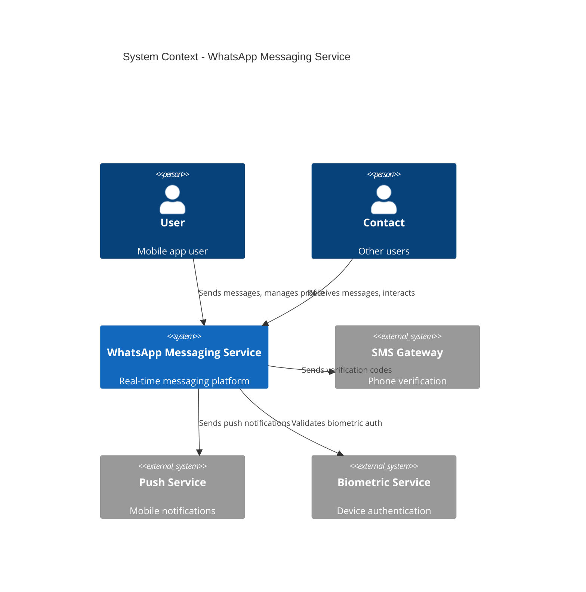
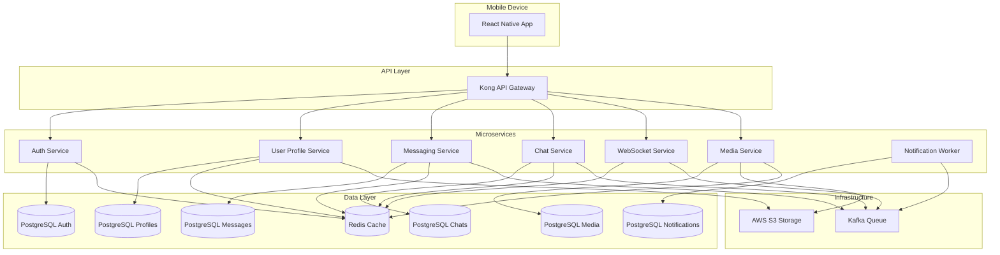
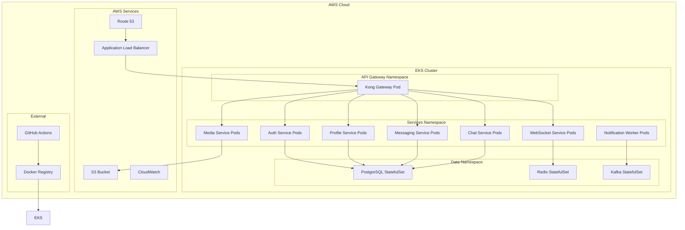
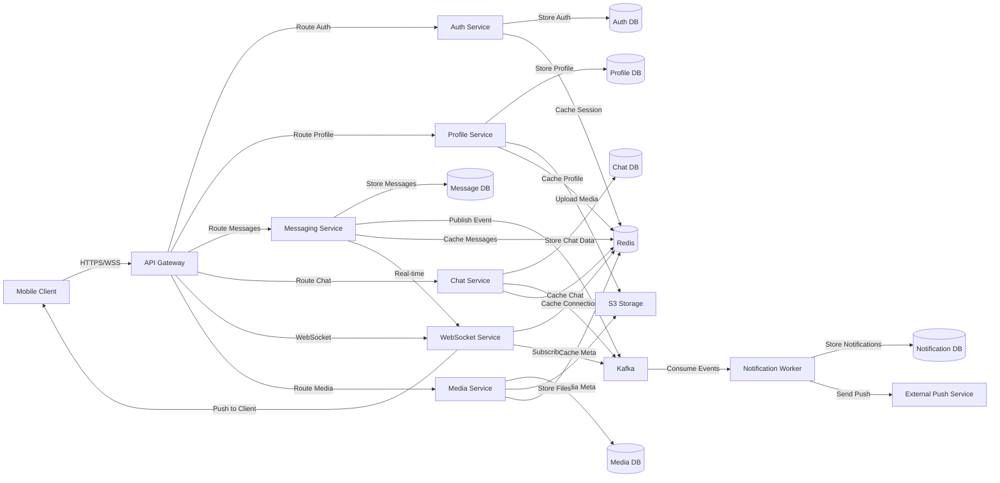

# Architecture - whatsapp-messaging-service

## Overview

| Property | Value |
|----------|-------|
| Architecture Pattern | **Microservices** |
| Communication Patterns | REST, WebSocket, Event-Driven |
| Total Services | 17 |

---

## Services

### api-gateway

| Property | Value |
|----------|-------|
| Type | gateway |
| Technology | Kong 3.7.1 |
| Ports | 8000, 8001 |

**Responsibilities:**
- Request Routing
- Rate Limiting
- Authentication
- Load Balancing

### auth-service

| Property | Value |
|----------|-------|
| Type | api |
| Technology | NestJS 10.3.2 |
| Ports | 3001 |
| Dependencies | postgres-auth, redis-cache |

**Responsibilities:**
- Phone Number Registration
- 2FA Management
- Biometric Auth
- Multi-Device Support
- Passkey Management

### user-profile-service

| Property | Value |
|----------|-------|
| Type | api |
| Technology | NestJS 10.3.2 |
| Ports | 3002 |
| Dependencies | postgres-profiles, redis-cache, s3-storage |

**Responsibilities:**
- Profile Management
- Profile Picture Upload
- Display Name
- Status Text
- QR Code Generation

### messaging-service

| Property | Value |
|----------|-------|
| Type | api |
| Technology | NestJS 10.3.2 |
| Ports | 3003 |
| Dependencies | postgres-messages, redis-cache, kafka-queue, websocket-service |

**Responsibilities:**
- Text Messages
- Voice Messages
- Message Operations
- Message Forwarding
- Message Reactions

### chat-service

| Property | Value |
|----------|-------|
| Type | api |
| Technology | NestJS 10.3.2 |
| Ports | 3004 |
| Dependencies | postgres-chats, redis-cache, kafka-queue |

**Responsibilities:**
- Chat Management
- Chat Locking
- Disappearing Messages
- View-Once Media

### websocket-service

| Property | Value |
|----------|-------|
| Type | api |
| Technology | NestJS 10.3.2 |
| Ports | 3005 |
| Dependencies | redis-cache, kafka-queue |

**Responsibilities:**
- Real-time Communication
- WebSocket Connections
- Live Message Delivery
- Presence Management

### media-service

| Property | Value |
|----------|-------|
| Type | api |
| Technology | NestJS 10.3.2 |
| Ports | 3006 |
| Dependencies | s3-storage, postgres-media, redis-cache |

**Responsibilities:**
- Media Upload
- Media Processing
- Media Storage
- View-Once Media Management

### notification-worker

| Property | Value |
|----------|-------|
| Type | worker |
| Technology | NestJS 10.3.2 |
| Ports | 3007 |
| Dependencies | kafka-queue, postgres-notifications |

**Responsibilities:**
- Push Notifications
- Email Notifications
- SMS Notifications
- Notification Templates

### postgres-auth

| Property | Value |
|----------|-------|
| Type | database |
| Technology | PostgreSQL 16.3 |
| Ports | 5432 |

**Responsibilities:**
- User Authentication Data
- Device Registration
- 2FA Settings
- Passkey Storage

### postgres-profiles

| Property | Value |
|----------|-------|
| Type | database |
| Technology | PostgreSQL 16.3 |
| Ports | 5433 |

**Responsibilities:**
- User Profiles
- Profile Pictures Metadata
- Display Names
- Status Information

### postgres-messages

| Property | Value |
|----------|-------|
| Type | database |
| Technology | PostgreSQL 16.3 |
| Ports | 5434 |

**Responsibilities:**
- Message Storage
- Message History
- Message Metadata
- Reactions

### postgres-chats

| Property | Value |
|----------|-------|
| Type | database |
| Technology | PostgreSQL 16.3 |
| Ports | 5435 |

**Responsibilities:**
- Chat Metadata
- Chat Settings
- Chat Participants
- Chat Security

### postgres-media

| Property | Value |
|----------|-------|
| Type | database |
| Technology | PostgreSQL 16.3 |
| Ports | 5436 |

**Responsibilities:**
- Media Metadata
- Media References
- Media Access Control

### postgres-notifications

| Property | Value |
|----------|-------|
| Type | database |
| Technology | PostgreSQL 16.3 |
| Ports | 5437 |

**Responsibilities:**
- Notification Queue
- Notification History
- Notification Settings

### redis-cache

| Property | Value |
|----------|-------|
| Type | cache |
| Technology | Redis 7.2.5 |
| Ports | 6379 |

**Responsibilities:**
- Session Storage
- Message Cache
- Profile Cache
- Real-time Data

### kafka-queue

| Property | Value |
|----------|-------|
| Type | queue |
| Technology | Kafka 3.7.1 |
| Ports | 9092 |

**Responsibilities:**
- Message Events
- Notification Events
- User Events
- System Events

### s3-storage

| Property | Value |
|----------|-------|
| Type | api |
| Technology | AWS S3 |
| Ports | 443 |

**Responsibilities:**
- Media Storage
- Profile Pictures
- Voice Messages
- File Attachments

---

## C4 Context Diagram

## C4 Container Diagram

## Deployment Diagram

## Data Flow Diagram

---

See `architecture/` directory for individual `.mmd` diagram files.
