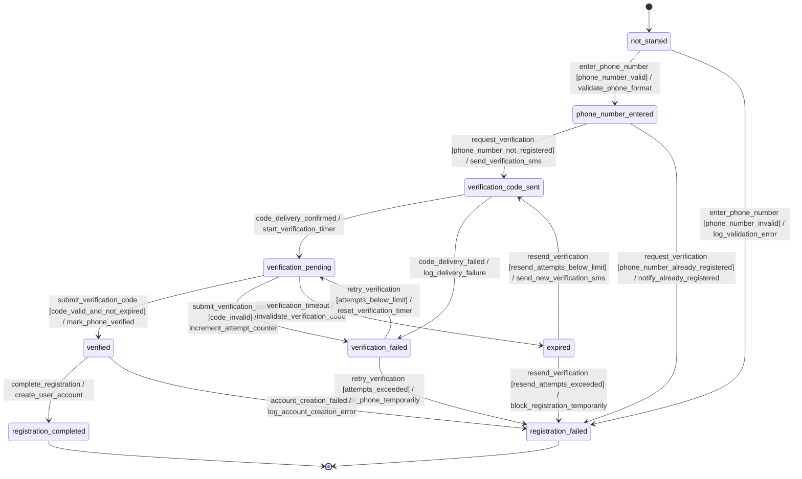
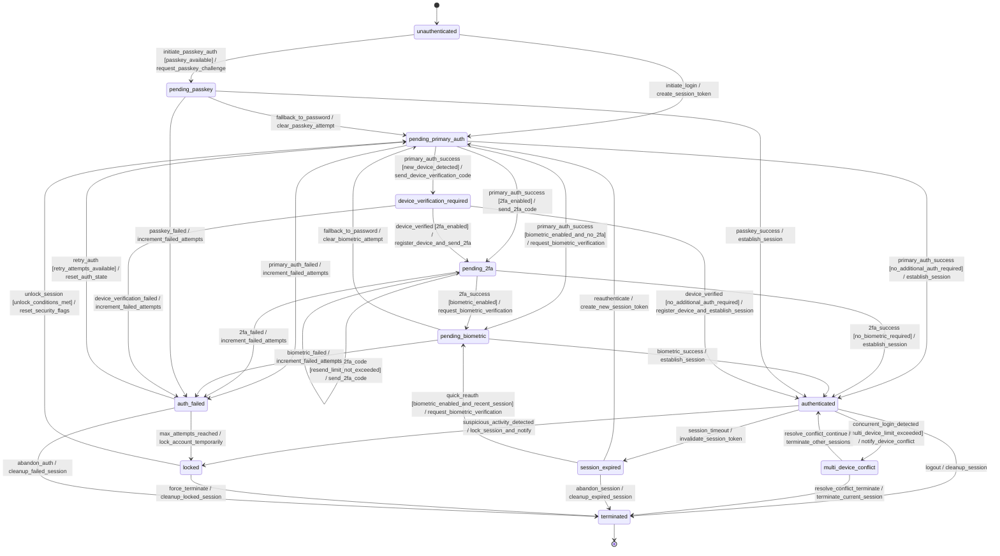
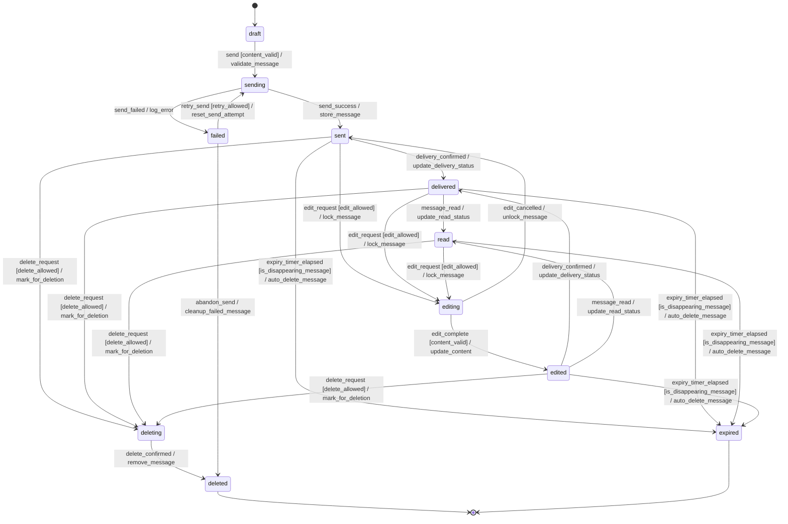
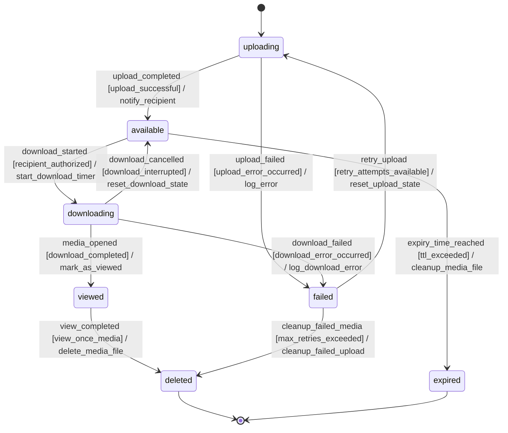
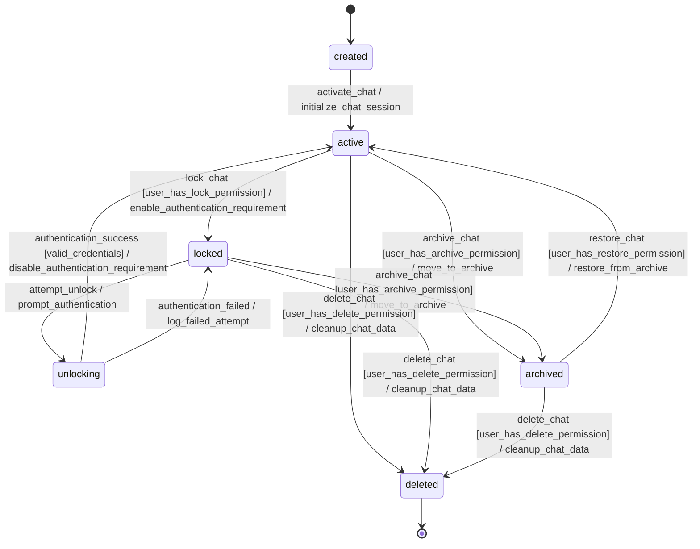
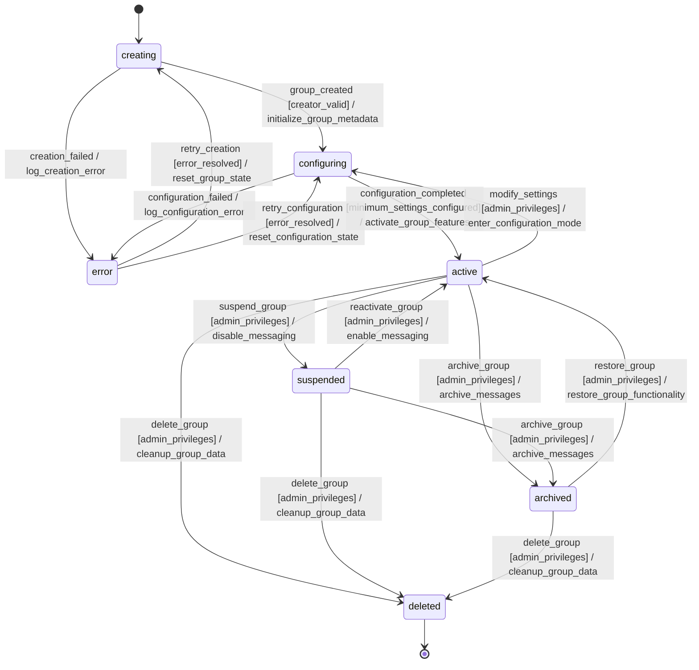
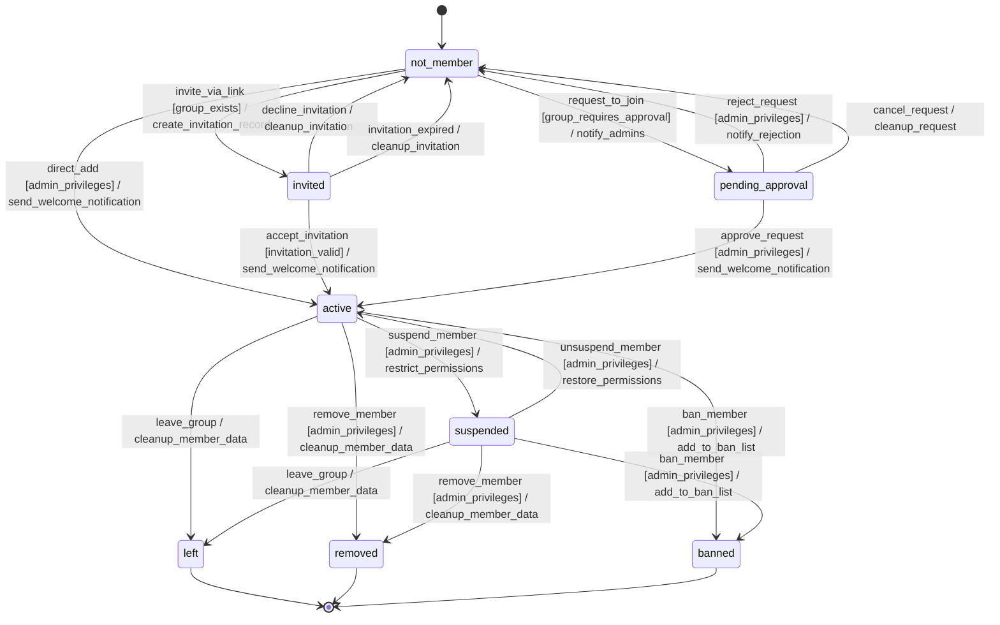
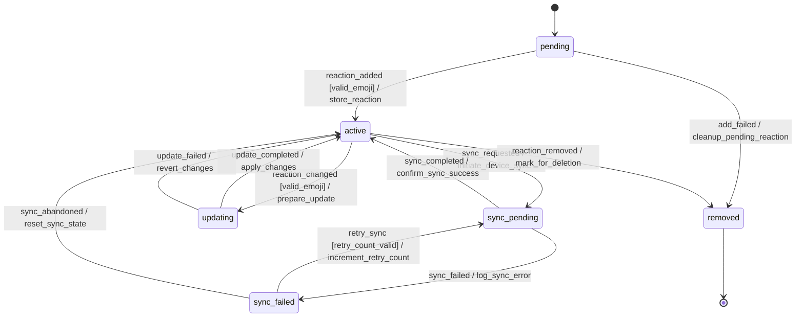

# State Machines

Insgesamt **8** State Machines identifiziert.

---

## 1. User Registration

_Durchläuft Registrierung von Telefonnummer-Eingabe über Verifizierung bis zur Aktivierung_

### Zustaende

| Zustand | Typ |
|---------|-----|
| `not_started` | Initial |
| `phone_number_entered` |  |
| `verification_code_sent` |  |
| `verification_pending` |  |
| `verification_failed` |  |
| `verified` |  |
| `registration_completed` | Final |
| `registration_failed` | Final |
| `expired` |  |

### Uebergaenge

| Von | Nach | Trigger | Guard | Action |
|-----|------|---------|-------|--------|
| `not_started` | `phone_number_entered` | `enter_phone_number` | phone_number_valid | validate_phone_format |
| `not_started` | `registration_failed` | `enter_phone_number` | phone_number_invalid | log_validation_error |
| `phone_number_entered` | `verification_code_sent` | `request_verification` | phone_number_not_registered | send_verification_sms |
| `phone_number_entered` | `registration_failed` | `request_verification` | phone_number_already_registered | notify_already_registered |
| `verification_code_sent` | `verification_pending` | `code_delivery_confirmed` | - | start_verification_timer |
| `verification_code_sent` | `verification_failed` | `code_delivery_failed` | - | log_delivery_failure |
| `verification_pending` | `verified` | `submit_verification_code` | code_valid_and_not_expired | mark_phone_verified |
| `verification_pending` | `verification_failed` | `submit_verification_code` | code_invalid | increment_attempt_counter |
| `verification_pending` | `expired` | `verification_timeout` | - | invalidate_verification_code |
| `verification_failed` | `verification_pending` | `retry_verification` | attempts_below_limit | reset_verification_timer |
| `verification_failed` | `registration_failed` | `retry_verification` | attempts_exceeded | block_phone_temporarily |
| `expired` | `verification_code_sent` | `resend_verification` | resend_attempts_below_limit | send_new_verification_sms |
| `expired` | `registration_failed` | `resend_verification` | resend_attempts_exceeded | block_registration_temporarily |
| `verified` | `registration_completed` | `complete_registration` | - | create_user_account |
| `verified` | `registration_failed` | `account_creation_failed` | - | log_account_creation_error |

### Diagramm

### Quell-Requirements

- WA-AUTH-001

---

## 2. Auth Session

_Verwaltet Anmeldezustände mit verschiedenen Authentifizierungsmethoden und Multi-Device-Support_

### Zustaende

| Zustand | Typ |
|---------|-----|
| `unauthenticated` | Initial |
| `pending_primary_auth` |  |
| `pending_2fa` |  |
| `pending_biometric` |  |
| `pending_passkey` |  |
| `authenticated` |  |
| `session_expired` |  |
| `locked` |  |
| `device_verification_required` |  |
| `multi_device_conflict` |  |
| `auth_failed` |  |
| `terminated` | Final |

### Uebergaenge

| Von | Nach | Trigger | Guard | Action |
|-----|------|---------|-------|--------|
| `unauthenticated` | `pending_primary_auth` | `initiate_login` | - | create_session_token |
| `unauthenticated` | `pending_passkey` | `initiate_passkey_auth` | passkey_available | request_passkey_challenge |
| `pending_primary_auth` | `pending_2fa` | `primary_auth_success` | 2fa_enabled | send_2fa_code |
| `pending_primary_auth` | `pending_biometric` | `primary_auth_success` | biometric_enabled_and_no_2fa | request_biometric_verification |
| `pending_primary_auth` | `device_verification_required` | `primary_auth_success` | new_device_detected | send_device_verification_code |
| `pending_primary_auth` | `authenticated` | `primary_auth_success` | no_additional_auth_required | establish_session |
| `pending_primary_auth` | `auth_failed` | `primary_auth_failed` | - | increment_failed_attempts |
| `pending_2fa` | `pending_biometric` | `2fa_success` | biometric_enabled | request_biometric_verification |
| `pending_2fa` | `authenticated` | `2fa_success` | no_biometric_required | establish_session |
| `pending_2fa` | `auth_failed` | `2fa_failed` | - | increment_failed_attempts |
| `pending_2fa` | `pending_2fa` | `resend_2fa_code` | resend_limit_not_exceeded | send_2fa_code |
| `pending_biometric` | `authenticated` | `biometric_success` | - | establish_session |
| `pending_biometric` | `auth_failed` | `biometric_failed` | - | increment_failed_attempts |
| `pending_biometric` | `pending_primary_auth` | `fallback_to_password` | - | clear_biometric_attempt |
| `pending_passkey` | `authenticated` | `passkey_success` | - | establish_session |
| `pending_passkey` | `auth_failed` | `passkey_failed` | - | increment_failed_attempts |
| `pending_passkey` | `pending_primary_auth` | `fallback_to_password` | - | clear_passkey_attempt |
| `device_verification_required` | `pending_2fa` | `device_verified` | 2fa_enabled | register_device_and_send_2fa |
| `device_verification_required` | `authenticated` | `device_verified` | no_additional_auth_required | register_device_and_establish_session |
| `device_verification_required` | `auth_failed` | `device_verification_failed` | - | increment_failed_attempts |
| `authenticated` | `multi_device_conflict` | `concurrent_login_detected` | multi_device_limit_exceeded | notify_device_conflict |
| `authenticated` | `session_expired` | `session_timeout` | - | invalidate_session_token |
| `authenticated` | `locked` | `suspicious_activity_detected` | - | lock_session_and_notify |
| `authenticated` | `terminated` | `logout` | - | cleanup_session |
| `multi_device_conflict` | `authenticated` | `resolve_conflict_continue` | - | terminate_other_sessions |
| `multi_device_conflict` | `terminated` | `resolve_conflict_terminate` | - | terminate_current_session |
| `session_expired` | `pending_primary_auth` | `reauthenticate` | - | create_new_session_token |
| `session_expired` | `pending_biometric` | `quick_reauth` | biometric_enabled_and_recent_session | request_biometric_verification |
| `session_expired` | `terminated` | `abandon_session` | - | cleanup_expired_session |
| `locked` | `pending_primary_auth` | `unlock_session` | unlock_conditions_met | reset_security_flags |
| `locked` | `terminated` | `force_terminate` | - | cleanup_locked_session |
| `auth_failed` | `locked` | `max_attempts_reached` | - | lock_account_temporarily |
| `auth_failed` | `pending_primary_auth` | `retry_auth` | retry_attempts_available | reset_auth_state |
| `auth_failed` | `terminated` | `abandon_auth` | - | cleanup_failed_session |

### Diagramm

### Quell-Requirements

- WA-AUTH-002
- WA-AUTH-003
- WA-AUTH-004
- WA-AUTH-005

---

## 3. Message

_Durchläuft Lebenszyklus von Erstellung über Zustellung, Bearbeitung bis hin zur automatischen Löschung_

### Zustaende

| Zustand | Typ |
|---------|-----|
| `draft` | Initial |
| `sending` |  |
| `sent` |  |
| `delivered` |  |
| `read` |  |
| `editing` |  |
| `edited` |  |
| `deleting` |  |
| `deleted` | Final |
| `expired` | Final |
| `failed` |  |

### Uebergaenge

| Von | Nach | Trigger | Guard | Action |
|-----|------|---------|-------|--------|
| `draft` | `sending` | `send` | content_valid | validate_message |
| `sending` | `sent` | `send_success` | - | store_message |
| `sending` | `failed` | `send_failed` | - | log_error |
| `sent` | `delivered` | `delivery_confirmed` | - | update_delivery_status |
| `delivered` | `read` | `message_read` | - | update_read_status |
| `sent` | `editing` | `edit_request` | edit_allowed | lock_message |
| `delivered` | `editing` | `edit_request` | edit_allowed | lock_message |
| `read` | `editing` | `edit_request` | edit_allowed | lock_message |
| `editing` | `edited` | `edit_complete` | content_valid | update_content |
| `editing` | `sent` | `edit_cancelled` | - | unlock_message |
| `edited` | `delivered` | `delivery_confirmed` | - | update_delivery_status |
| `edited` | `read` | `message_read` | - | update_read_status |
| `sent` | `deleting` | `delete_request` | delete_allowed | mark_for_deletion |
| `delivered` | `deleting` | `delete_request` | delete_allowed | mark_for_deletion |
| `read` | `deleting` | `delete_request` | delete_allowed | mark_for_deletion |
| `edited` | `deleting` | `delete_request` | delete_allowed | mark_for_deletion |
| `deleting` | `deleted` | `delete_confirmed` | - | remove_message |
| `sent` | `expired` | `expiry_timer_elapsed` | is_disappearing_message | auto_delete_message |
| `delivered` | `expired` | `expiry_timer_elapsed` | is_disappearing_message | auto_delete_message |
| `read` | `expired` | `expiry_timer_elapsed` | is_disappearing_message | auto_delete_message |
| `edited` | `expired` | `expiry_timer_elapsed` | is_disappearing_message | auto_delete_message |
| `failed` | `sending` | `retry_send` | retry_allowed | reset_send_attempt |
| `failed` | `deleted` | `abandon_send` | - | cleanup_failed_message |

### Diagramm

### Quell-Requirements

- WA-MSG-001
- WA-MSG-003
- WA-MSG-004
- WA-MSG-008

---

## 4. Message Media

_Spezielle Zustandsübergänge für View-Once Medien von verfügbar zu angezeigt zu gelöscht_

### Zustaende

| Zustand | Typ |
|---------|-----|
| `uploading` | Initial |
| `available` |  |
| `downloading` |  |
| `viewed` |  |
| `deleted` | Final |
| `expired` | Final |
| `failed` |  |

### Uebergaenge

| Von | Nach | Trigger | Guard | Action |
|-----|------|---------|-------|--------|
| `uploading` | `available` | `upload_completed` | upload_successful | notify_recipient |
| `uploading` | `failed` | `upload_failed` | upload_error_occurred | log_error |
| `available` | `downloading` | `download_started` | recipient_authorized | start_download_timer |
| `available` | `expired` | `expiry_time_reached` | ttl_exceeded | cleanup_media_file |
| `downloading` | `viewed` | `media_opened` | download_completed | mark_as_viewed |
| `downloading` | `available` | `download_cancelled` | download_interrupted | reset_download_state |
| `downloading` | `failed` | `download_failed` | download_error_occurred | log_download_error |
| `viewed` | `deleted` | `view_completed` | view_once_media | delete_media_file |
| `failed` | `uploading` | `retry_upload` | retry_attempts_available | reset_upload_state |
| `failed` | `deleted` | `cleanup_failed_media` | max_retries_exceeded | cleanup_failed_upload |

### Diagramm

### Quell-Requirements

- WA-MSG-009

---

## 5. Chat

_Kann zwischen entsperrt und gesperrt wechseln, mit verschiedenen Sicherheitsstufen_

### Zustaende

| Zustand | Typ |
|---------|-----|
| `created` | Initial |
| `active` |  |
| `locked` |  |
| `unlocking` |  |
| `archived` |  |
| `deleted` | Final |

### Uebergaenge

| Von | Nach | Trigger | Guard | Action |
|-----|------|---------|-------|--------|
| `created` | `active` | `activate_chat` | - | initialize_chat_session |
| `active` | `locked` | `lock_chat` | user_has_lock_permission | enable_authentication_requirement |
| `locked` | `unlocking` | `attempt_unlock` | - | prompt_authentication |
| `unlocking` | `active` | `authentication_success` | valid_credentials | disable_authentication_requirement |
| `unlocking` | `locked` | `authentication_failed` | - | log_failed_attempt |
| `active` | `archived` | `archive_chat` | user_has_archive_permission | move_to_archive |
| `locked` | `archived` | `archive_chat` | user_has_archive_permission | move_to_archive |
| `archived` | `active` | `restore_chat` | user_has_restore_permission | restore_from_archive |
| `active` | `deleted` | `delete_chat` | user_has_delete_permission | cleanup_chat_data |
| `locked` | `deleted` | `delete_chat` | user_has_delete_permission | cleanup_chat_data |
| `archived` | `deleted` | `delete_chat` | user_has_delete_permission | cleanup_chat_data |

### Diagramm

### Quell-Requirements

- WA-MSG-010

---

## 6. Group Chat

_Durchläuft Erstellung, Konfiguration, aktive Phase und mögliche Auflösung_

### Zustaende

| Zustand | Typ |
|---------|-----|
| `creating` | Initial |
| `configuring` |  |
| `active` |  |
| `suspended` |  |
| `archived` |  |
| `deleted` | Final |
| `error` |  |

### Uebergaenge

| Von | Nach | Trigger | Guard | Action |
|-----|------|---------|-------|--------|
| `creating` | `configuring` | `group_created` | creator_valid | initialize_group_metadata |
| `creating` | `error` | `creation_failed` | - | log_creation_error |
| `configuring` | `active` | `configuration_completed` | minimum_settings_configured | activate_group_features |
| `configuring` | `error` | `configuration_failed` | - | log_configuration_error |
| `active` | `suspended` | `suspend_group` | admin_privileges | disable_messaging |
| `active` | `archived` | `archive_group` | admin_privileges | archive_messages |
| `active` | `deleted` | `delete_group` | admin_privileges | cleanup_group_data |
| `active` | `configuring` | `modify_settings` | admin_privileges | enter_configuration_mode |
| `suspended` | `active` | `reactivate_group` | admin_privileges | enable_messaging |
| `suspended` | `archived` | `archive_group` | admin_privileges | archive_messages |
| `suspended` | `deleted` | `delete_group` | admin_privileges | cleanup_group_data |
| `archived` | `active` | `restore_group` | admin_privileges | restore_group_functionality |
| `archived` | `deleted` | `delete_group` | admin_privileges | cleanup_group_data |
| `error` | `creating` | `retry_creation` | error_resolved | reset_group_state |
| `error` | `configuring` | `retry_configuration` | error_resolved | reset_configuration_state |

### Diagramm

### Quell-Requirements

- WA-GRP-001
- WA-GRP-002
- WA-GRP-003

---

## 7. Group Member

_Verwaltet Mitgliedschaftsstatus von Einladung über aktive Teilnahme bis zum Verlassen_

### Zustaende

| Zustand | Typ |
|---------|-----|
| `not_member` | Initial |
| `invited` |  |
| `pending_approval` |  |
| `active` |  |
| `suspended` |  |
| `left` | Final |
| `removed` | Final |
| `banned` | Final |

### Uebergaenge

| Von | Nach | Trigger | Guard | Action |
|-----|------|---------|-------|--------|
| `not_member` | `invited` | `invite_via_link` | group_exists | create_invitation_record |
| `not_member` | `pending_approval` | `request_to_join` | group_requires_approval | notify_admins |
| `not_member` | `active` | `direct_add` | admin_privileges | send_welcome_notification |
| `invited` | `active` | `accept_invitation` | invitation_valid | send_welcome_notification |
| `invited` | `not_member` | `decline_invitation` | - | cleanup_invitation |
| `invited` | `not_member` | `invitation_expired` | - | cleanup_invitation |
| `pending_approval` | `active` | `approve_request` | admin_privileges | send_welcome_notification |
| `pending_approval` | `not_member` | `reject_request` | admin_privileges | notify_rejection |
| `pending_approval` | `not_member` | `cancel_request` | - | cleanup_request |
| `active` | `left` | `leave_group` | - | cleanup_member_data |
| `active` | `removed` | `remove_member` | admin_privileges | cleanup_member_data |
| `active` | `banned` | `ban_member` | admin_privileges | add_to_ban_list |
| `active` | `suspended` | `suspend_member` | admin_privileges | restrict_permissions |
| `suspended` | `active` | `unsuspend_member` | admin_privileges | restore_permissions |
| `suspended` | `left` | `leave_group` | - | cleanup_member_data |
| `suspended` | `removed` | `remove_member` | admin_privileges | cleanup_member_data |
| `suspended` | `banned` | `ban_member` | admin_privileges | add_to_ban_list |

### Diagramm

### Quell-Requirements

- WA-GRP-004
- WA-GRP-005

---

## 8. Message Reaction

_Kann hinzugefügt, geändert oder entfernt werden mit Synchronisation zwischen Geräten_

### Zustaende

| Zustand | Typ |
|---------|-----|
| `pending` | Initial |
| `active` |  |
| `updating` |  |
| `sync_pending` |  |
| `sync_failed` |  |
| `removed` | Final |

### Uebergaenge

| Von | Nach | Trigger | Guard | Action |
|-----|------|---------|-------|--------|
| `pending` | `active` | `reaction_added` | valid_emoji | store_reaction |
| `pending` | `removed` | `add_failed` | - | cleanup_pending_reaction |
| `active` | `updating` | `reaction_changed` | valid_emoji | prepare_update |
| `active` | `sync_pending` | `sync_requested` | - | initiate_device_sync |
| `active` | `removed` | `reaction_removed` | - | mark_for_deletion |
| `updating` | `active` | `update_completed` | - | apply_changes |
| `updating` | `active` | `update_failed` | - | revert_changes |
| `sync_pending` | `active` | `sync_completed` | - | confirm_sync_success |
| `sync_pending` | `sync_failed` | `sync_failed` | - | log_sync_error |
| `sync_failed` | `sync_pending` | `retry_sync` | retry_count_valid | increment_retry_count |
| `sync_failed` | `active` | `sync_abandoned` | - | reset_sync_state |

### Diagramm

### Quell-Requirements

- WA-MSG-007

---

